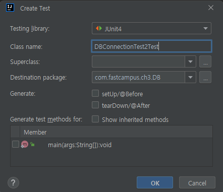
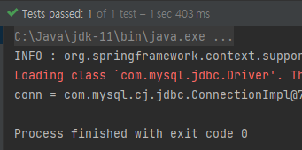

## Spring 으로 DB 연결하기

- mySQL driver 가 없어서 그냥 컴파일하면 error "no suitable driver found for..."
- JDBC driver - from Maven repository (https://mvnrepository.com/) -> mysql 검색
- MySQL Connector/J -> Pom.xml로 복사
```
<!-- https://mvnrepository.com/artifact/com.mysql/mysql-connector-j -->
<dependency>
    <groupId>com.mysql</groupId>
    <artifactId>mysql-connector-j</artifactId>
    <version>8.0.32</version>
</dependency>
```
-> 복사후 maven -> reload project[web.xml](..%2F..%2F..%2F..%2F..%2Fwebapp%2FWEB-INF%2Fweb.xml) <br>
 : external library에 추가 완료

## Spring JDBC driver
- Maven repository -> spring jdbc 검색
- Spring JDBC -> Pom.xml로 복사
```
<!-- https://mvnrepository.com/artifact/org.springframework/spring-jdbc -->
<dependency>
    <groupId>org.springframework</groupId>
    <artifactId>spring-jdbc</artifactId>
    <version>6.0.8</version>
</dependency>
```
 
but 
6.x.x 대 버전을 쓰면 
```
class file has wrong version 61.0, should be 55.0
```
에러 발생함 -> 5.3.27 버전 OK
```
<!-- https://mvnrepository.com/artifact/org.springframework/spring-jdbc -->
<dependency>
    <groupId>org.springframework</groupId>
    <artifactId>spring-jdbc</artifactId>
    <version>5.3.27</version>
</dependency>
```
## Test code 작성
1. 테스트할 코드 복사 
2. 마우스 우클릭 -> go to -> test -> Create New Test 
3. JUnit4 여야함 <br>

4. method는 void, @Test annotation을 붙여야함
```java
public class DBConnectionTest2Test {
    @Test
    public void springJdbcConnectionTest() throws Exception{
        ApplicationContext ac = new GenericXmlApplicationContext("file:src/main/webapp/WEB-INF/spring/**/root-context.xml");
        DataSource ds = ac.getBean(DataSource.class);

        Connection conn = ds.getConnection(); // 데이터베이스의 연결을 얻는다.

        System.out.println("conn = " + conn);
        assertTrue(conn!=null); // 괄호안의 조건식이 true이면 성공, 아니면 실패
    }
}
```
5. 실행하면 passed or failed 표시<br>


6. 자동으로 테스트코드를 가져오려면?
- Maven repository -> spring test 검색
- Spring TestContext Framework -> Pom.xml <!-- Test --> 아래로 복사
```
<!-- Test -->
<!-- https://mvnrepository.com/artifact/org.springframework/spring-test -->
<dependency>
    <groupId>org.springframework</groupId>
    <artifactId>spring-test</artifactId>
    <version>${org.springframework-version}</version>
    <scope>test</scope>
</dependency>
```

- JUNIT version도 4.12이상으로 변경해줘야함 (원래 4.7로 되어 있었음)
```
<dependency>
    <groupId>junit</groupId>
    <artifactId>junit</artifactId>
    <version>4.12</version>
    <scope>test</scope>
</dependency>      
```
이후 @RunWith, @ContextConfiguration, @Autowired annotation을 사용하면 수동으로 하지 않아도 test 가능
```
@RunWith(SpringJUnit4ClassRunner.class)
@ContextConfiguration(locations = {"file:src/main/webapp/WEB-INF/spring/**/root-context.xml"})
public class DBConnectionTest2Test {
    @Autowired
    DataSource ds;

    @Test
    public void springJdbcConnectionTest() throws Exception{
//        ApplicationContext ac = new GenericXmlApplicationContext("file:src/main/webapp/WEB-INF/spring/**/root-context.xml");
//        DataSource ds = ac.getBean(DataSource.class);

        Connection conn = ds.getConnection(); // 데이터베이스의 연결을 얻는다.

        System.out.println("conn = " + conn);
        assertTrue(conn!=null); // 괄호안의 조건식이 true이면 성공, 아니면 실패
    }
}
```