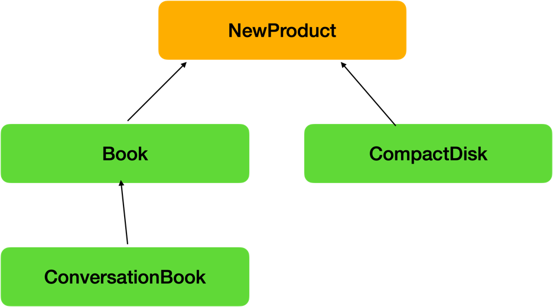

# 다형성(Polymorphism)
- 하나의 참조변수로 여러 타입의 객체를 참조할 수 있는것, 조상의 참조변수로 자손의 타입의 객체를 다를수 있는것!

```java
import com.sun.jdi.connect.spi.TransportService;

class TV {
    1;
    2;
    3;
    4;
}

class CaptionTV extends TV {
    5;
    6;
}

TV t = new TV();
CaptionTV c = new CaptionTV();

TV t = new CaptionTV();
```
- 다형성의 가치 : 다양한 매개변수가 필요한 메서드를 효율적으로 구현할수 있다.  다양한 제품이 입력될때 Product 참조변수 하나로 대체 가능
- 조상타입의 참조변수는 자손 타입을 다룰 수는 있지만 절대 근본(자신의 타입)은 벗어나지 못한다.
- TV t는 멤버변수가 4개, Caption c는 매개변수 6개
- 자손클래스의 메서드가 오버라이딩 된다면 오버라이딩된 메서드가 호출된다.
- [PlayerEx.java](PlayerEx.java)
- [Player.java](Player.java)
- [Striker.java](Striker.java)
- [MidFielder.java](MidFielder.java)
- [Defender.java](Defender.java)

### 다형성으로인한 형변환
- 형변환의 전제조건 : 상속, 구현관계에 있는 것만 객체타입 변환이 가능
- 자손 타입ㅁ에서 조상타입으로 형변환은 생략가능하지만, 반대는 명시적 형변환을 반드시 해야한다.
```java
자손타입 -> 조상타입 (up-casting) : 형변환 생략가능 (조작 멤버갯수가 줄어듬)
자손타입 <- 조상타입 (down-casting) : 형변환 생략불가 (조작 멤버갯수가 많아짐)
자손끼리는 casting 안됨!
```

### instanceof 연산자
- 참조변수가 참조하는 인스턴스의 실제 타입을 체크하는데 사용한다.
- 이항연산자, 연산결과는 boolean값이 된다.
- instanceof의 연산결과가 true이면, 해당 타입으로 형변환이 가능하다.
```java
SportCar sportCar = new SportCar();

if (sportCar instanceof SportCar) {
    System.out.println("SportCar로 타입변환이 가능합니다."
}
if (sportCar instanceof Car) {
System.out.println("Car로 타입변환이 가능합니다."
}
if (sportCar instanceof Object) {
System.out.println("Object로 타입변환이 가능합니다."
}
if (sportCar instanceof PoliceCar) {
System.out.println("PoliceCar로 타입변환이 가능합니다."
}
```
- instanceof 연산자는 실제 형변환이 가능한지 알아볼때  쓰는것이 유용하다.

### 다형성의 형변환
```java
Car car = null;
SportCar sportCar = new SportCar();
SportCar sportCar1 = null;
PoliceCar policeCar = new PoliceCar();

sportCar.speedUp();
car = sportCar; // up-casting (자손 -> 조상), 조작할수 있는 멤버가 줄어든다.
//  car.speedUp(); // up-casting되어 멤버가 줄어들기때문에 speedUp이 없어짐.
// 다운캐스팅할 때, 명시적으로 형변환 코드를 작성해야한다.
sportCar1 = (SportCar)car; // down-casting (조상 -> 자손 ), 조작할수 있는 멤버가 늘어난다.
sportCar1.speedUp(); // SportCar에는 speedUp()을 지원하므로 사용 가능

// 아래 코드는 서로 상속관계가 아니기때문에 형변환이 절대 이루어지지 않음.
// sportCar = (SportCar)policeCar; // 자손끼리는 캐스팅이 불가하다,
```
- [Car.java](Car.java)
- [SportCar.java](SportCar.java)
- [PoliceCar.java](PoliceCar.java)
- [CarEx.java](CarEx.java)

```java
SportCar sportCar = new SportCar();

// 상속계층도 : Object <- Car <- SportCar
if (sportCar instanceof SportCar) {
    System.out.println("SportCar로 타입변환이 가능합니다.");
}

if (sportCar instanceof Car) {
    System.out.println("Car 로 타입변환이 가능합니다.");
}

if (sportCar instanceof Object) {
    System.out.println("Object 로 타입변환이 가능합니다.");
}
```
- [InstaceOf.java](InstanceOf.java)

```java
Parent parent = new Child();
Child child = new Child();

// 멤버변수는 근본을 벗어나지 못함
System.out.println(parent.x); // parent의 x값 출력
System.out.println(child.x); // child의 x값 출력

// 멤버메서드는 현재 참조하고 있는 인스턴스에 영향을 받음.
parent.method(); // 자손의 method 호출 (오버라이딩된 메서드)
child.method(); // 자손의 method 호출 (오버라이딩된 메서드)

parent.type(new Child());
```
- [Parent.java](Parent.java)
- [Child.java](Child.java)
- [ReferEx.java](ReferEx.java)


### 매개변수의 다형성
- 참조타입 매개변수는 메서드 호출시, 자신과 같은 타입이거나 또는 자손타입의 주소를 즉, 인스턴스를 넘겨주도록 한다.
```java
class Product {
    int price;
    int bonusPoint;
}

class TV extends Product {}
class Computer extends Product {}
class Audio extends Product {}

class Buyer {
    int money;
    int bonuesPoint;
}
```
- 이렇게 클래스가 있을때 buy 메서드의 매개변수를 TV t로 하면 TV로 선언된 instance만 받을 수 있고 다른 물건들에 대해 별개의 method를 오버라이딩해서 구현해야한다.
```java
void buy(TV t) {
    money -= t.price;
    bonusPoint += t.bonusPoint;
}
```
- 그러나 다형성을 이용해서 Product로 선언된 instance를 매개변수로 쓴다면 하나의 method로 구현가능하다.
```java
Product p1 = new TV();
Product p2 = new Computer();
Product p3 = new Audio();

void buy(Product p) {
    money -= t.price;
    bonusPoint += t.bonusPoint;
}
```
- [PlyArgument.java](PolyArgument.java)
- [Product.java](Product.java)
- [TV.java](TV.java)
- [Computer.java](Computer.java)
- [Audio.java](Audio.java)
- [Apple.java](Apple.java)
- [Buyer.java](Buyer.java)

### 여러종류의 객체를 배열로
조상타입의 배열에는 조상뿐만 아니라 자손의 객체도 담을 수 있다. (다형성)
```java
Product p1 = new TV();
Product p2 = new Computer();
Product p3 = new Audio();
```
-> 
```java
Product p[]] = new Product[3];
p[0] = new TV();
p[1] = new Computer();
p[2] = new Audio();
```

- 객체배열과 상속관계를 이용한 다형성 구현 연습
- Book, CD, ConversionBook 상품을 입력받고 배열추가로 다형성 구현


- [NewProduct.java](NewProduct.java)
- [Book.java](Book.java)
- [CompactDisk.java](CompactDisk.java)
- [ConversationBook.java](ConversationBook.java)
- [ProductEx.java](ProductEx.java)


- 배열은 메모리 관리가 비효율적이라 Vector -> ArrayList, LinkedList
```java
Product[] cart = new Product[10];
//...
void buy (Product p) {
    cart[i++] = p;
}
```
-> 
```java
Vector cart = new Vector();
//...
void buy (Product p) {
    cart.add(p);
}
```
- Vector를 이용한 연습 (Vector는 모든 객체를 담을수 있다)
- [Board.java](Board.java)
- [BoardEx.java](BoardEx.java)