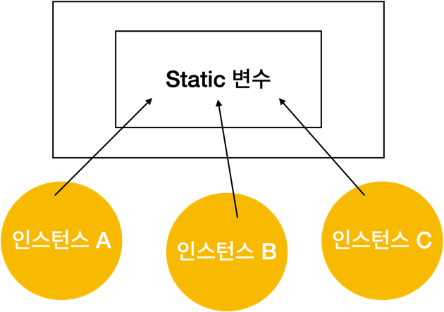
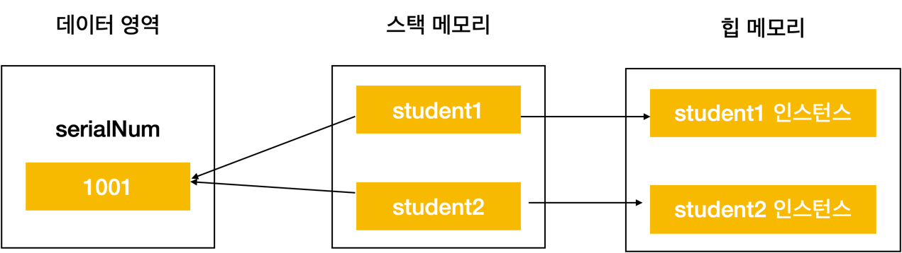
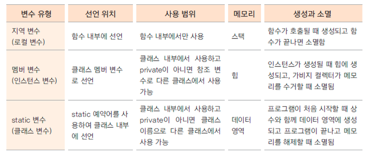

# Static 변수

- 여러 인스턴스가 공유하는 값
- 학생의 학번
- 카드회사의 카드번호
- 회사원의 사번 등



- 인스턴스가 생성도리때 만들어지는 변수가 아닌, 처음 프로그램이 메모리에 로딩될때 할당됨
- 클래스 변수, 정적변수라고도 함
- 인스턴스 생성과 상관없이 사용 가능하므로 클래스 이름으로 직접 참조

- (Student.serialNum = 100;)


- serialNum이 static 변수로 선언 되어 있으므로
```
public class Employee {
    public static int serialNum = 1000;

```
- 인스턴스와 상관없이 공통 접근이 가능함
```
Employee employee1 = new Employee();
employee1.setName("이순신");

System.out.println(employee1.serialNum);
Employee employee2 = new Employee();
employee2.setName("김유신");
employee2.serialNum++;

System.out.println(employee1.serialNum);
System.out.println(employee2.serialNum);
```
- [Employee.java](Employee.java)
- [EmployeeTest.java](EmployeeTest.java)


- 메모리 영역




# Static Method

- private 선언 -> getter/setter로 구현

```
private static int serialNum = 1000;

 ...
public static int getSerialNum() {
	return serialNum;
}

public static void setSerialNum(int serialNum) {
	Employee.serialNum = serialNum;
}
```

- static 메서드에서는 인스턴스 변수를 사용할 수 없다.

# 변수의 유효 범위와 메모리



- 변수의 유효 범위(scope)와 생성과 소멸(life cycle)은 각 변수의 종류마다 다름
- 지역변수, 멤버 변수, 클래스 변수는 유효범위와 life cycle, 사용하는 메모리도 다름
- static 변수는 프로그램이 메모리에 있는 동안 계속 그 영역을 차지하므로 너무 큰 메모리를 할당하는 것은 좋지 않음
- 클래스 내부의 여러 메서드에서 사용하는 변수는 멤버 변수로 선언하는 것이 좋음
- 멤버 변수가 너무 많으면 인스턴스 생성 시 쓸데없는 메모리가 할당됨
- 상황에 적절하게 변수를 사용해야 함

# 싱글턴 패턴
- 하나의 Company 객체를 static 객체로 선언해서 call 하는 부분에서 공용으로 접근할수 있음.
- [Company.java](Company.java)
- [CompanyTest.java](CompanyTest.java)


- static, 싱글턴 패턴 복습
- 구현 : 자동차 공장이 있습니다.  자동차 공장은 유일한 객체이고, 이 공장에서 생성되는 자동차는 제작될 때마다 고유의 번호가 부여됩니다.
- 자동차 번호가 10001부터 시작되어 자동차가 생산될 때마다 10002, 10003 이렇게 번호가 붙도록 자동차 공장 클래스, 자동차 클래스를 구현하세요.
- 다음 CarFactoryTest.java 테스트 코드가 수행되도록 합니다.
- [Car.java](Car.java)
- [CarFactory.java](CarFactory.java)
- [CarFactoryTest.java](CarFactoryTest.java)